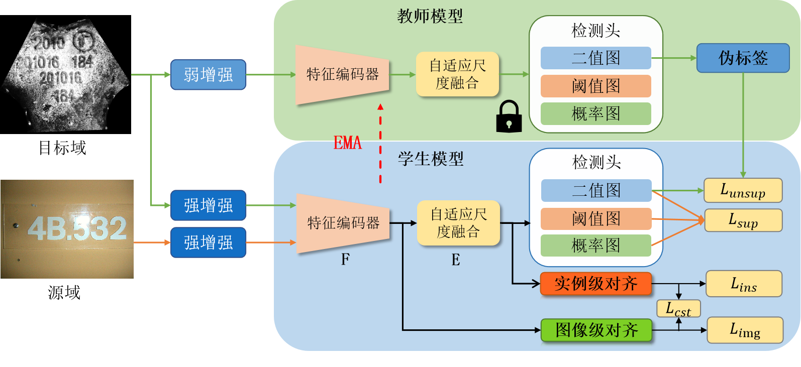

## 基于领域自适应的工业场景文本检测方法
<p>

</p>

#  Installation
 
## Prerequisites
- Python  3.8
- PaddlePaddle-gpu   2.2.2.post112
- Opencv 4.5.4
- [PaddleOCR](https://github.com/PaddlePaddle/PaddleOCR)

## Our tested environment

- A40 (8 batch size)

## Data download

1. Download the datasets
    
    将数据下载，放入train_data文件夹下
    - [数据](https://pan.baidu.com/s/1DGw8aQkoP30SXEQI9amWbw) 提取码： gt93 


2. Download the models
    将模型下载，放入train_models文件夹下
    - [model](https://pan.baidu.com/s/16rqbTttbtYgdTvEfMO7upA) 提取码：ul3c

## Training
```shell
python tools/train_domain.py -c domain_config/det_r50_db++_icdar13_mp_aug_pseduo_img_ins_cst.yaml
```
## Evaluation

```shell
python tools/eval.py -c domain_config/det_r50_db++_icdar13_mp_aug_pseduo_img_ins_cst.yaml -o Global.checkpoints='domain_output/det_r50_db++_icdar13_mp_aug_pseduo_img_ins_cst/best_accuracy'
```# DA_DB
